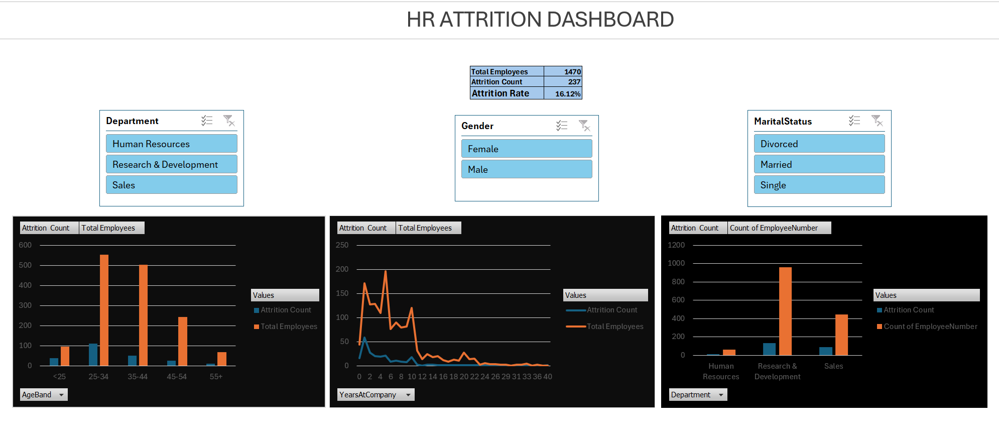

<p align="center">


</p>

<p align="center">
<b>An end-to-end HR Analytics project that analyzes employee attrition patterns using SQL, Excel, and interactive dashboards to identify workforce risks, uncover attrition drivers, and generate actionable retention strategies.</b>
</p>

---

# HR Attrition Analysis Dashboard

---

# Table of Contents

- [Project Overview](#-project-overview)
- [Business Problem](#-business-problem)
- [Project Objectives](#-project-objectives)
- [Dataset Information](#-dataset-information)
- [Tech Stack](#-tech-stack)
- [Project Workflow](#-project-workflow)
- [Data Cleaning & Preparation](#-data-cleaning--preparation)
- [Dashboard Development](#-dashboard-development)
- [Key Performance Indicators](#-key-performance-indicators)
- [Key Insights](#-key-insights)
- [Strategic Recommendations](#-strategic-recommendations)
- [Business Impact](#-business-impact)
- [Dashboard Preview](#-dashboard-preview)
- [Repository Structure](#-repository-structure)
- [Project Resources](#-project-resources)
- [Skills Demonstrated](#-skills-demonstrated)
- [Future Enhancements](#-future-enhancements)
- [Conclusion](#-conclusion)
- [Author](#-author)

---

# Project Overview

Employee attrition significantly impacts workforce productivity, operational continuity, recruitment costs, and organizational performance.

This project analyzes employee attrition using the IBM HR Analytics dataset to identify high-risk employee segments and uncover factors contributing to workforce turnover.

The project combines **SQL analysis**, **Excel dashboard development**, and **business intelligence techniques** to transform HR data into meaningful insights and actionable recommendations.

The dashboard enables stakeholders to:

- Monitor attrition trends
- Identify high-risk departments
- Analyze workforce demographics
- Understand tenure patterns
- Support data-driven HR decisions

---

# Business Problem

The organization is experiencing higher-than-expected employee turnover and wants to understand:

- Which departments have the highest attrition?
- Which job roles are at risk?
- Which employee groups leave most frequently?
- Does tenure affect employee retention?
- What actions can reduce workforce attrition?

Reducing employee turnover can lead to:

- Lower hiring costs
- Improved productivity
- Better employee satisfaction
- Stronger workforce stability
- Increased organizational performance

---

# Project Objectives

### Workforce Objectives

- Measure overall employee attrition
- Identify high-risk departments
- Analyze job role turnover patterns
- Analyze employee demographics
- Study employee tenure behavior
- Generate business recommendations
- Support strategic HR decision-making

---

# Dataset Information

**Dataset Source:** IBM HR Analytics Employee Attrition Dataset

### Dataset Summary

| Metric | Value |
|----------|--------|
| Total Employees | 1,470 |
| Total Features | 35 |
| Employees Leaving | 237 |
| Attrition Rate | 16.1% |

---

### Features Included

### Employee Information

- Employee Age
- Gender
- Marital Status
- Department
- Job Role

### Employment Information

- Years at Company
- Monthly Income
- Job Satisfaction
- Work Experience

### Target Variable

- Attrition Status (Yes / No)

---

# Tech Stack

| Technology | Purpose |
|------------|----------|
| MySQL | Data Analysis |
| Microsoft Excel | Dashboard Development |
| Pivot Tables | Data Aggregation |
| Charts & Slicers | Interactive Analysis |
| Git & GitHub | Version Control |

---

# Project Workflow

```text
Raw Dataset (.CSV)
          │
          ▼
Data Cleaning
(Excel)
          │
          ▼
MySQL Analysis
          │
          ▼
Dashboard Development
(Excel)
          │
          ▼
Business Insights
          │
          ▼
Strategic Recommendations
```

---

# Data Cleaning & Preparation

Data preprocessing was performed before dashboard creation.

### Tasks Performed

- Imported raw dataset
- Removed inconsistencies
- Checked missing values
- Standardized categories
- Validated records
- Created calculated fields

### Additional Fields Created

**AgeBand**

Employees categorized into:

- <25
- 25–34
- 35–44
- 45–54
- 55+

**Attrition Flag**

```sql
CASE
WHEN Attrition='Yes' THEN 1
ELSE 0
END
```

---

# Dashboard Development

An interactive HR Attrition Dashboard was created in Excel.

### Dashboard KPIs

- Total Employees
- Attrition Count
- Attrition Rate

### Dashboard Visualizations

- Attrition by Department
- Attrition by Age Group
- Attrition by Years at Company
- Employee Distribution Analysis

### Dashboard Filters

- Department
- Gender
- Marital Status

---

# Key Performance Indicators

| KPI | Value |
|------|--------|
| Total Employees | **1,470** |
| Attrition Count | **237** |
| Retained Employees | **1,233** |
| Attrition Rate | **16.1%** |

---

# Key Insights

## Department Analysis

| Department | Attrition Rate |
|-------------|----------------|
| Sales | 20.6% |
| Human Resources | 19.1% |
| Research & Development | 13.8% |

**Insight:**

Sales demonstrates the highest employee turnover and requires immediate attention.

Possible reasons:

- High workload pressure
- Performance targets
- Compensation concerns
- Career progression limitations

---

## Job Role Analysis

Highest-risk roles:

| Job Role | Attrition Rate |
|-----------|----------------|
| Sales Representative | 39.8% |
| Laboratory Technician | 23.9% |
| Human Resources | 23.1% |
| Sales Executive | 17.5% |

---

## Age Group Analysis

| Age Group | Attrition Rate |
|------------|----------------|
| <25 | 39.2% |
| 25–34 | 20.2% |
| 35–44 | 10.1% |
| 45–54 | 10.2% |
| 55+ | 15.9% |

**Insight:**

Employees below age 35 show substantially higher attrition rates.

---

## Tenure Analysis

Key observations:

- Highest attrition occurs within the first 0–3 years
- Attrition decreases after 4–5 years
- Long-tenured employees demonstrate stronger retention

**Insight:**

Early employee engagement significantly impacts retention.

---

# Strategic Recommendations

## Improve Employee Onboarding

Actions:

- Structured onboarding plans
- Mentorship programs
- First 90-day engagement strategy

---

## Focus on High-Risk Roles

Target groups:

- Sales Representatives
- Sales Executives
- HR Staff
- Laboratory Technicians

Actions:

- Employee feedback surveys
- Workload assessments
- Compensation review

---

## Strengthen Career Development

Actions:

- Transparent promotion paths
- Learning programs
- Internal mobility opportunities
- Skill development initiatives

---

## Retain Younger Employees

Actions:

- Career growth plans
- Training opportunities
- Internal movement programs
- Better expectation alignment

---

## Continuous KPI Monitoring

Track:

- Overall attrition
- Department attrition
- Under-35 attrition
- Early-tenure attrition

---

# Business Impact

Potential business benefits include:

✅ Reduced employee turnover

✅ Lower recruitment costs

✅ Higher productivity

✅ Improved employee satisfaction

✅ Stronger workforce stability

✅ Better decision-making

---

# Dashboard Preview

## HR Attrition Dashboard



---

# Repository Structure

```text
HR-Attrition-Analysis
│
├── hr_attrition_dashboard.xlsx
├── hr_attrition_mysql.sql
├── hr_attrition_raw.csv
├── HR Attrition Analysis Report.docx
├── hr_attrition_dashboard.png
└── README.md
```

---

# Project Resources

| Resource | Description |
|-----------|-------------|
| HR Attrition Analysis Report.docx | Detailed Business Report |
| hr_attrition_dashboard.xlsx | Interactive Dashboard |
| hr_attrition_mysql.sql | SQL Queries |
| hr_attrition_raw.csv | Raw Dataset |

---

# Skills Demonstrated

### SQL

- Data Cleaning
- Aggregation
- CASE Statements
- Workforce Analysis

### Excel

- Pivot Tables
- Slicers
- KPI Cards
- Dashboard Design
- Interactive Visualizations

### Business Analytics

- HR Analytics
- Employee Segmentation
- Attrition Analysis
- KPI Reporting
- Data Storytelling

---

# Future Enhancements

- Build predictive attrition models using Machine Learning
- Deploy dashboards in Power BI
- Create automated ETL pipelines
- Add salary and satisfaction analysis
- Develop real-time HR monitoring dashboards

---

# Conclusion

The analysis shows that employee attrition is concentrated among specific workforce groups rather than being evenly distributed across the organization.

The strongest risk indicators identified were:

- Sales-related roles
- Younger employees
- Early-tenure employees
- High-pressure operational functions

A focused retention strategy based on data-driven insights can significantly reduce turnover and improve long-term organizational performance.

---

# Author

## Kartik Kachwahe

**Aspiring Data Scientist | Data Analyst | SQL | Power BI | Excel | Business Intelligence**

📧 Email: kartikkachwahe25@gmail.com

💼 LinkedIn: https://www.linkedin.com/in/kartikkachwahe021

💻 GitHub: https://github.com/KartikKachwahe

---

## Support

If you found this project helpful or learned something from it, consider giving this repository a ⭐

It helps others discover the project and motivates future development.

---

**Thank you for visiting this repository!**
